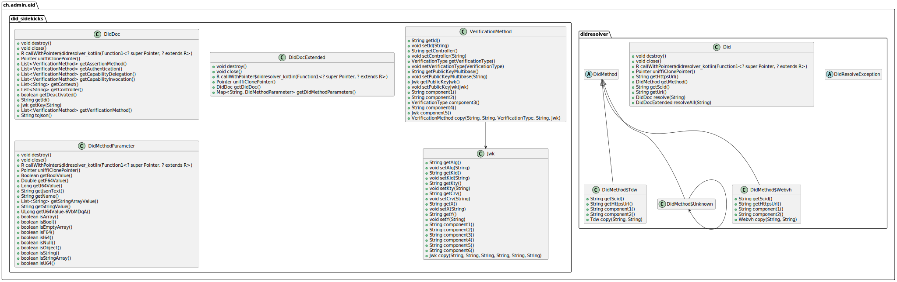

# DID resolver for Kotlin applications

This project contains language bindings required for loading and using the [DID resolver](https://github.com/swiyu-admin-ch/didresolver) library in Java/Kotlin applications.

To [configure Apache Maven](https://central.sonatype.org/consume/consume-apache-maven/) to consume a published package from [Maven Central Repository](https://repo1.maven.org/maven2/ch/admin/swiyu/didresolver),
edit the `pom.xml` file to include the package as a `dependency`:

```xml
<dependency>
    <groupId>ch.admin.swiyu</groupId>
    <artifactId>didresolver</artifactId>
    <!--version>[ANY_AVAILABLE_VERSION]</version-->
</dependency>
```

To [configure Gradle](https://central.sonatype.org/consume/consume-gradle/) to consume a published package from [Maven Central Repository](https://repo1.maven.org/maven2/ch/admin/swiyu/didresolver),
add the package to `dependencies` section in your `build.gradle.kts` (Kotlin DSL) file:

```kotlin
implementation("ch.admin.swiyu:didresolver:[ANY_AVAILABLE_VERSION]")
```

You are more then welcome to explore the relevant [examples](https://github.com/swiyu-admin-ch/didresolver-examples) in a further detail.

## The DID Resolver (Kotlin/Java) API

The sole bedrock of DID Resolver (Kotlin/Java) API are the classes residing in the `ch.admin.eid.didresolver` package:



## Contributions and feedback

We welcome any feedback on the code regarding both the implementation and security aspects. Please follow the guidelines for contributing found in [CONTRIBUTING](./CONTRIBUTING.md).

## License

This project is licensed under the terms of the MIT license. See the [LICENSE](./LICENSE.md) file for details.
